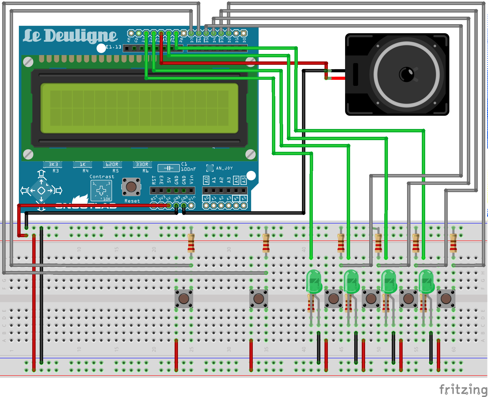

# はじめに
タイトルの通り、Arduinoを使ってドラムシーケンサを作ってみた！

なにを作りたいかは、まずこの動画を見てほしい。
[Kick arduino drum machine - YouTube](https://www.youtube.com/watch?v=HLgUDv-POcg)

今回はこのドラムマシンのトラックを、自由に編集して再生できるようにしたものを作る。

# 作る
全くの初心者で、まず材料の入手からはじまる。

<blockquote class="twitter-tweet">
今朝ですけど、電子工作の材料が届きました <a href="https://t.co/UwTnQ6RBoB">pic.twitter.com/UwTnQ6RBoB</a>
&mdash; まつも (@m47ch4n) <a href="https://twitter.com/m47ch4n/status/1142385157535485952?ref_src=twsrc%5Etfw">June 22, 2019</a></blockquote>

わくわくしてきた。ハンダは使わず、材料も必要最小限です。次に、Fritzingで配線を考える。

入力として、6つのタクトスイッチがあり、左から順に、モード切替スイッチ、カーソル切り替えスイッチ、音符セットスイッチ(4つ)として使う。

出力はI2C接続のLCDと、4つのLEDがある。

実際に配線し、使ったLCDやスイッチなどのテストプログラムを起動してみる。

LEDの位置は、ボタンを押しやすくするため奥の方へ移動。

<blockquote class="twitter-tweet" data-conversation="none">
UIから作った。テストした感じ正常に動いてる。 <a href="https://t.co/fa79JuU6tf">pic.twitter.com/fa79JuU6tf</a>
&mdash; まつも (@m47ch4n) <a href="https://twitter.com/m47ch4n/status/1142430504471318528?ref_src=twsrc%5Etfw">June 22, 2019</a></blockquote>

それから、Arduinoスケッチを書く。
[m47ch4n/DrumSequencer](https://github.com/m47ch4n/DrumSequencer)

参考にしたサイトは以下の通りである。

- [thehugh100/Simple-Arduino-Drum-Machine](https://github.com/thehugh100/Simple-Arduino-Drum-Machine/)
- [ストロベリー・リナックス/秋月電子のI2C液晶/OLEDほかをArduinoで使う](https://n.mtng.org/ele/arduino/i2c.html)

# 結果
<blockquote class="twitter-tweet">
Improve UI😊 <a href="https://t.co/UWACif6P2X">pic.twitter.com/UWACif6P2X</a>
&mdash; まつも (@m47ch4n) <a href="https://twitter.com/m47ch4n/status/1143879295908978688?ref_src=twsrc%5Etfw">June 26, 2019</a></blockquote>

BPMを2進数で入力したり、音符の設定も4つずつしかできなかったりと、ひどいUXである。実はこのツイートの前はもっと酷く、少しは改善したのである。エコに済ませたいと思って進めていった結果である。しょうがないのでエコを貫くことにする。とりあえず、UIの大幅な改修だ！

TODO
- UX改善。カーソル移動を4つごとではなく、左右移動用の2つのスイッチで行う。
- それに伴いLEDの用途を考え直す。
- BPMの2進数入力をやめる。再生時に左右移動スイッチでできるようにするのが良さそう。
- LEDが点灯したらLCDのコントラストが低下するのをなんとかする。
- カタカナ音符やめて、カスタム文字でわかりやすく表示する。

\#2 へつづくかもしれない
