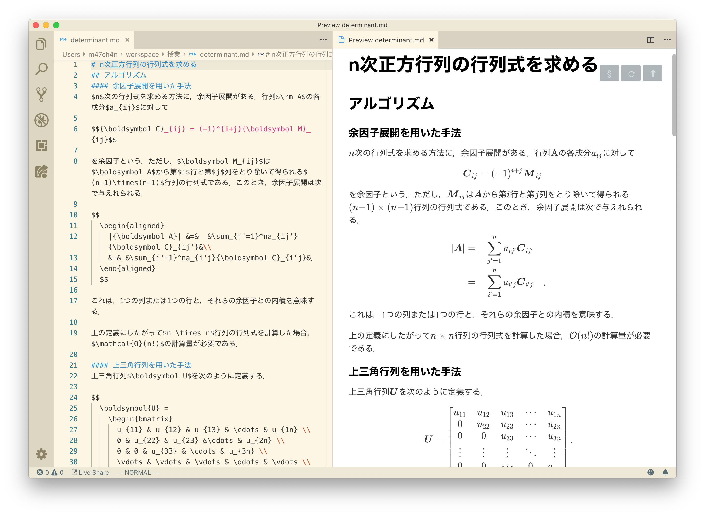
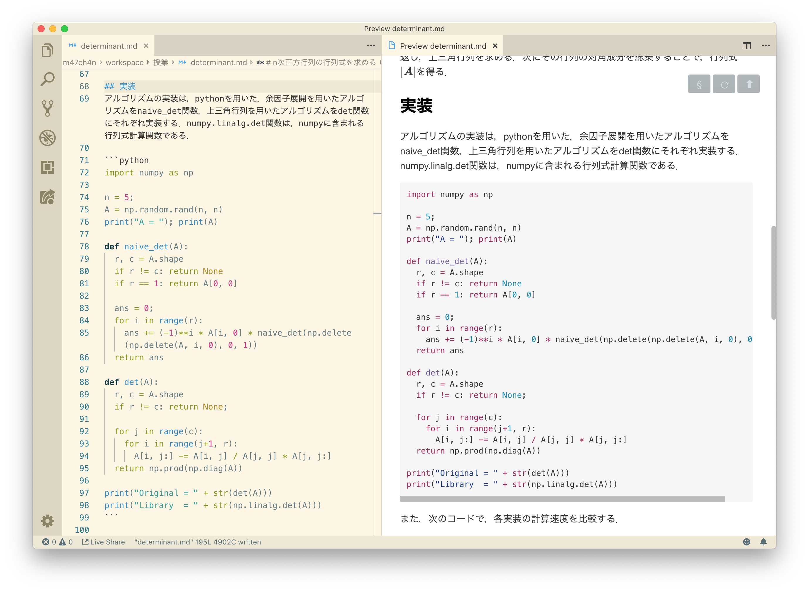

ちょっとしたレポート書くときに、LaTeXほど高機能の組版はいらないし、ソースコードをそのまま貼りたいって時は、Markdownで書きたい。

今回は、試しにMarkdownでレポート書いてみた。そのときに使ったvscodeの拡張機能を紹介します。

---

[Markdown Preview Enhanced](https://marketplace.visualstudio.com/items?itemName=shd101wyy.markdown-preview-enhanced)が多機能で便利!

Markdown Preview Enhancedは数式、レイアウト、mermaidによるグラフ、PlantUMLによるUML、PDFやHTMLでの出力などを提供する拡張機能。

数式のデフォルトレンダラはKaTeX。とにかく速いらしい！

等号を揃えるコマンドは、`align`ではなく`aligned`だったり、ちょっと仕様が違ってたりするが、それ以外は不満なく使えてる。

コードもMarkdownなのでシンプルに貼り付けるだけ。

Markdownで書きたけど、LaTeXのようにしっかりとした組版システムを使いたい場合、[Pandoc](https://pandoc.org/)というものもあるらしい。

- [学位論文を書く準備 - プらチナの日記](https://blog.8tak4.com/post/168232661994/know-how-writing-thesis-markdown)

学位論文私もMarkdownでやってみようかな？