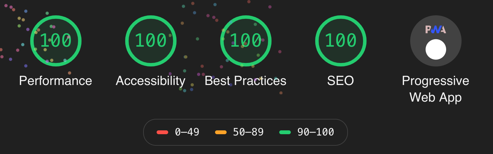

## はじめに
まつもです。

まつもは非暴力的で禁欲的な良いやつです。

[グッズ](https://suzuri.jp/m47ch4n)あります。

## 主題
Gatsby で自分のホームページを作成した。

動機は手段。学校の友人から**Gatsby**をオススメされたのが動機。

Gatsbyについて
- 静的サイトジェネレータ
- リソースをGraphQLで一元管理
- UIはReactで書く
- 画像最適化などのプラグインがとても強力
- 検索時はしっかり js をつけよう

Starterの1つである
[gatsby-starter-blog](https://www.gatsbyjs.org/starters/gatsbyjs/gatsby-starter-blog/)
を元に書いていくと

爆速サイトができた（びっくり！）。

ホームページは**名刺**がテーマ。簡潔。

/blog も簡潔。カテゴリ機能ぐらいはほしい。あと、画像オンリー記事は特別表示したい。

ポートフォリオとしても機能させたいので、 /works や /history が生えるかも。

コンタクトいるかな？ TwitterのDMがあるからいらないと思う。

とにかく爆速を保とう。